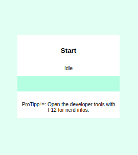

# speedtest

Simple upload and download bandwidth test in browser javascript.

## Demo




## Workflow

Download:

- Test download with 5 Megabytes of data
- Calculate a amount of data for a 15 Seconds long test
- Perform download speed test

Upload:

- Test upload with 5 Megabytes of data
- Calculate a amount of data for a 15 Seconds long test
- Perform upload speed test

## Installation

Just download the index.html:

```sh
wget "https://github.com/perryflynn/speedtest/raw/upload/index.html"
```

### Generate a large test file for download

```sh
# generates a 5GB large test file
dd if=/dev/urandom of=5000mb.bin bs=512 count=10000000
```

The test mechanism uses [HTTP Byte Range Requests](https://developer.mozilla.org/en-US/docs/Web/HTTP/Range_requests).
After a short negotiation with 5 Megabytes, it uses extact this amount
of data to run a test for 15 seconds.

### Create fake endpoint for uploads

The following example NGINX configuration creates a fake endpoint
for uploading test data which is streamed into `/dev/null`:

```
location /upload {
    gzip off;
    client_max_body_size 10G;
    client_body_buffer_size 1m;
    client_body_in_single_buffer on;

    echo_read_request_body;
    access_log /dev/null postdata;
    default_type text/plain;
    return 200 "OK";
}
```

**This not work with HTTP2!**

If you have an idea why, please let me know. :-)

I also don't have any idea how good this upload mechanism scales.
Maybe you should create an PHP (or whatever) script which streams the
upload to `/dev/null`.

## Note on testing

With these kind of tools you are testing the available bandwidth of
the slowest connection between your device and the host. When your web
server connection is slower than your own network, you are actually
testing the server's bandwidth instead of your own.

There can be many causes for slow connections, like the type of wiring,
other devices, interference, packetloss or the peering between network
providers somewhere along the route.

For example, I tested this speedtest from my own server to my home
network both connected from Amsterdam and I got only 70 Mbit but using
my provider's speedtest I get double at least. Doing the same to my
LiquidSky box in Frankfurt I easily get over 900 Mbit. So there is a
bottleneck somewhere between the web server and my home ISP.

## Unlicense

This is free and unencumbered software released into the public domain.

Anyone is free to copy, modify, publish, use, compile, sell, or
distribute this software, either in source code form or as a compiled
binary, for any purpose, commercial or non-commercial, and by any
means.

In jurisdictions that recognize copyright laws, the author or authors
of this software dedicate any and all copyright interest in the
software to the public domain. We make this dedication for the benefit
of the public at large and to the detriment of our heirs and
successors. We intend this dedication to be an overt act of
relinquishment in perpetuity of all present and future rights to this
software under copyright law.

THE SOFTWARE IS PROVIDED "AS IS", WITHOUT WARRANTY OF ANY KIND,
EXPRESS OR IMPLIED, INCLUDING BUT NOT LIMITED TO THE WARRANTIES OF
MERCHANTABILITY, FITNESS FOR A PARTICULAR PURPOSE AND NONINFRINGEMENT.
IN NO EVENT SHALL THE AUTHORS BE LIABLE FOR ANY CLAIM, DAMAGES OR
OTHER LIABILITY, WHETHER IN AN ACTION OF CONTRACT, TORT OR OTHERWISE,
ARISING FROM, OUT OF OR IN CONNECTION WITH THE SOFTWARE OR THE USE OR
OTHER DEALINGS IN THE SOFTWARE.

For more information, please refer to <http://unlicense.org/>

## The original Author

[Franklin van de Meent](https://fra.nkl.in)

Do you like this project?
Please consider to [buy me a coffee](https://ko-fi.com/franklin).

## Refactoring, negotiation mechanism and upload feature by

[Christian Blechert](https://serverless.industries/)

Do you like this project?
Please consider to [buy me a coffee](https://www.paypal.me/perryflynn).
